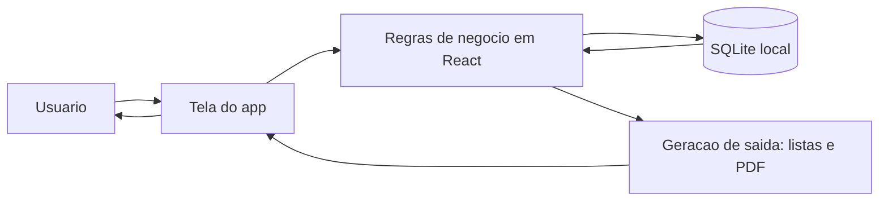

# 2. Participantes do processo de negocio

A solucao envolve participantes internos e externos. Internamente, a equipe do projeto e formada por Ana Beatriz Costa Viana, Grazielle Sorrentino Santos Souza, Gustavo Anselmo Santos Silva, Karina Oliveira Bicalho de Almeida e Nicole Marie Agnelo Marques, que atuam na definicao, organizacao e execucao dos processos de cadastro, acompanhamento e consulta de informacoes do sistema. Externamente, os fornecedores informam os itens disponiveis, unidade de venda, preco estimado e contato.

O aplicativo esta sendo desenvolvido para Terezinha Kaori Yamaguti, que e a principal parte interessada no uso da solucao. Nos processos de negocio, o cadastro de fornecedores, o cadastro/acompanhamento de pedidos e a consulta de produtos e relatorios sao executados pela equipe do projeto em conjunto com as informacoes recebidas dos fornecedores, com foco em atender as necessidades operacionais da solicitante. Nesta fase, nao ha autenticacao ou login, entao os participantes representam papeis operacionais do processo.

# 3.1.1. Processos e Propriedades

## Processo 1: Cadastro e Gestao de Fornecedores

Atividade: Cadastrar, editar e excluir fornecedores.

Prototipo: Tela Fornecedores.

| Nome | Nome da propriedade ou campo |
|---|---|
| Fornecedor | id |
| Fornecedor | nome |
| Fornecedor | contato |
| Fornecedor | atualizado_em |
| Fornecedor | ativo |
| ProdutoFornecedor | id |
| ProdutoFornecedor | fornecedor_id |
| ProdutoFornecedor | produto_id |
| ProdutoFornecedor | unidade_tipo |
| ProdutoFornecedor | unidade_outro |
| ProdutoFornecedor | preco_estimado |

---

## Processo 2: Cadastro e Acompanhamento de Pedidos

Atividade: Criar pedidos, atualizar status e consultar historico.

Prototipo: Tela Pedidos e Tela Historico.

| Nome | Nome da propriedade ou campo |
|---|---|
| Cliente | id |
| Cliente | nome |
| Cliente | contato |
|  Pedido| id |
| Pedido | cliente_id |
| Pedido | data_pedido |
| Pedido | data_entrega |
| Pedido | status |
| Pedido | observacoes |
| Pedido | entregue_em |
| PedidoItem | id |
| PedidoItem | pedido_id |
| PedidoItem | produto_id |
| PedidoItem | fornecedor_id |
| PedidoItem | quantidade |
| PedidoItem | unidade_aplicada |
| PedidoItem | preco_estimado_unitario |

---

## Processo 3: Consulta de Produtos e Relatorios

Atividade: Consultar produtos por fornecedor e emitir relatorios/backup.

Prototipo: Tela Produtos e acoes de exportacao.

| Nome | Nome da propriedade ou campo |
|---|---|
| Produto | id |
| Produto | nome |
| Produto | categoria |
| ProdutoFornecedor | fornecedor_id |
| ProdutoFornecedor | produto_id |
| BackupLog | id |
| BackupLog | usuario_id |
| BackupLog | tipo_operacao |
| BackupLog | criado_em |

---

## Processo 4: Autenticacao de Usuario

Atividade: Nao se aplica nesta fase do projeto.

Prototipo: Nao se aplica (a solucao nao tera login).

| Nome | Nome da propriedade ou campo |
|---|---|
| Nao se aplica | Nao se aplica |

# 3.2. Diagrama Entidade e Relacionamento (DER)

O modelo abaixo integra os processos definidos para pedidos, historico, fornecedores, produtos e backup local:

```mermaid
erDiagram
    CLIENTE ||--o{ PEDIDO : realiza
    PEDIDO ||--|{ PEDIDO_ITEM : contem

    PRODUTO ||--o{ PEDIDO_ITEM : compoe
    FORNECEDOR ||--o{ PEDIDO_ITEM : atende

    FORNECEDOR ||--o{ PRODUTO_FORNECEDOR : oferece
    PRODUTO ||--o{ PRODUTO_FORNECEDOR : disponivel_em

    CLIENTE {
      string id PK
      string nome
      string contato
      datetime criado_em
    }

    PEDIDO {
      string id PK
      string cliente_id FK
      date data_pedido
      date data_entrega
      string status
      text observacoes
      datetime criado_em
      datetime atualizado_em
    }

    PEDIDO_ITEM {
      string id PK
      string pedido_id FK
      string produto_id FK
      string fornecedor_id FK
      decimal quantidade
      string unidade_aplicada
      decimal preco_estimado_unitario
    }

    FORNECEDOR {
      string id PK
      string nome
      string contato
      boolean ativo
      datetime criado_em
      datetime atualizado_em
    }

    PRODUTO {
      string id PK
      string nome
      string categoria
      boolean ativo
      datetime criado_em
      datetime atualizado_em
    }

    PRODUTO_FORNECEDOR {
      string id PK
      string fornecedor_id FK
      string produto_id FK
      string unidade_tipo
      string unidade_outro
      decimal preco_estimado
      datetime atualizado_em
    }

    BACKUP_LOG {
      string id PK
      string tipo_operacao
      string origem
      datetime criado_em
    }
```

Observacoes de modelagem:

1. O historico pode ser implementado sem tabela separada, usando apenas o campo status na entidade PEDIDO (ex.: entregue).
2. A entidade PRODUTO_FORNECEDOR resolve a relacao N:N e guarda metadados da relacao (preco e unidade).
3. Nesta fase, nao ha entidades de autenticacao, pois a solucao nao tera login.

# 3.3. Tecnologias

## Tecnologias da solucao proposta

| Camada | Tecnologia | Funcao no projeto |
|---|---|---|
| Front-end web/app | React + Vite | Estrutura moderna, simples e rapida para desenvolver |
| Banco de dados local | SQLite | Banco leve, simples e sem necessidade de servidor |
| Persistencia complementar | JSON (backup/restauracao) | Facilita exportar e importar dados manualmente |
| Relatorios | jsPDF + jsPDF-AutoTable | Geracao de PDFs por tela |
| Desktop runtime | Electron | Empacotamento e execucao como app desktop |
| Mobile runtime | Capacitor + React | Estrutura para build Android |
| Build e dependencias | Node.js + npm | Execucao e gerenciamento de pacotes |
| IDE | Visual Studio Code | Desenvolvimento e manutencao |

Observacao: a solucao proposta nao utiliza backend, banco de dados em servidor ou autenticacao nesta fase. O banco SQLite fica no proprio dispositivo do usuario.

## Fluxo de interacao (usuario -> sistema -> resposta)

## Arquitetura da solucao proposta

1. A arquitetura segue o modelo local-first: interface + regras de negocio + persistencia local no proprio dispositivo.
2. O foco e manter a simplicidade, utilizando banco local SQLite.
3. Nesta fase, nao sera utilizado backend, banco em servidor, autenticacao ou login.
4. Se necessario no futuro, backend e autenticacao podem ser adicionados sem invalidar o DER proposto.
